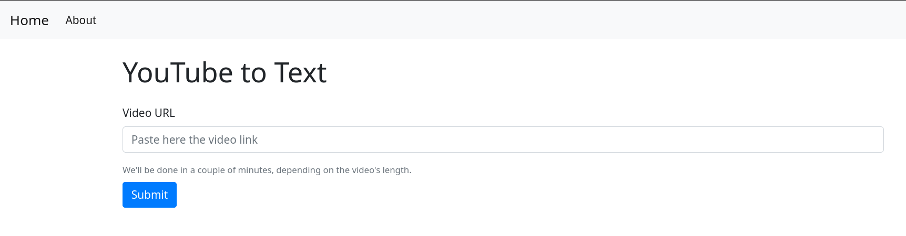

# YouTube to text

This is a web application that uses artificial intelligence to transcribe the speech from a YouTube video and store the text in a database.

## How it works

The user inputs the video url, and the server uses youtube-dl (yt_dlp) to query video information and to download only the audio, in the `./res/audio` folder. It also stores this information in a `sqlite3` database (`./res/videos.db`). After this it uses OpenAI's Whisper model to get the text from the audio, this processing is done asynchronously on a different thread.

## Libraries used

The third party python modules I used:
- flask
- yt_dlp
- whisper
- sqlalchemy

## License

[GPLv3](LICENSE) © [Stefan Asandei](https://www.stefan-asandei.cf)
